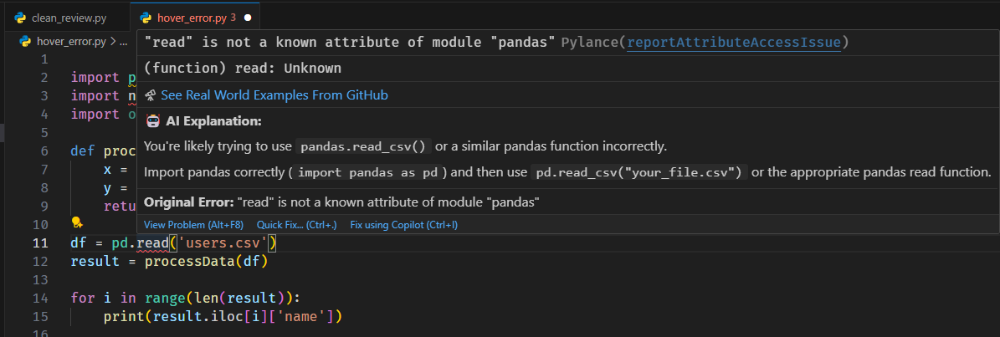
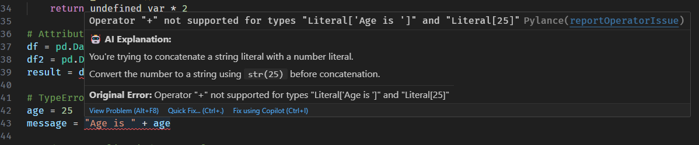
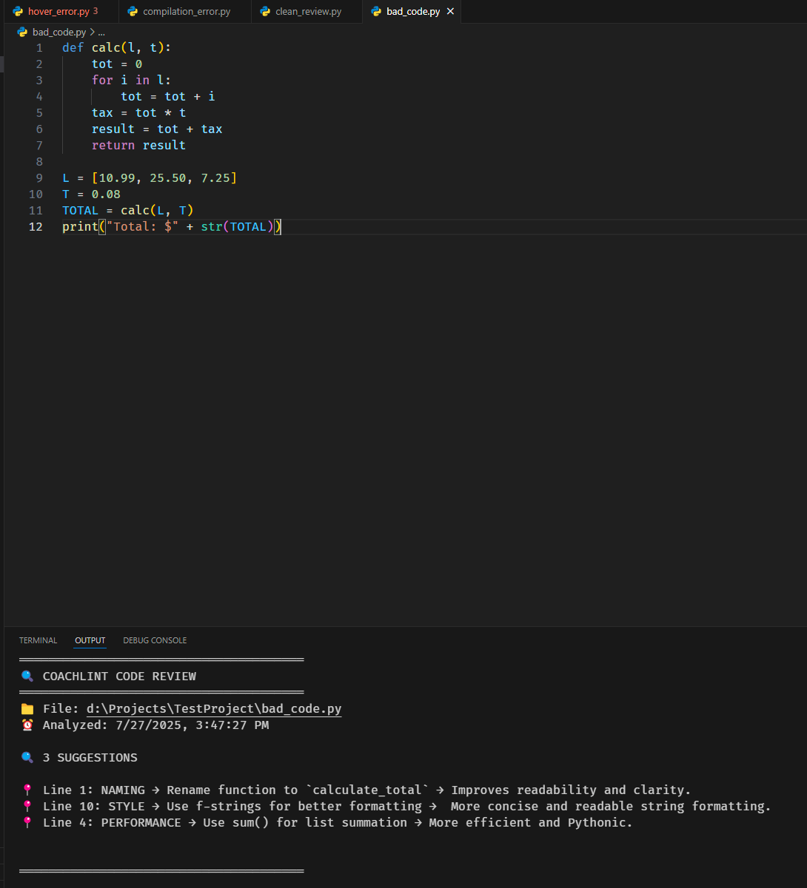
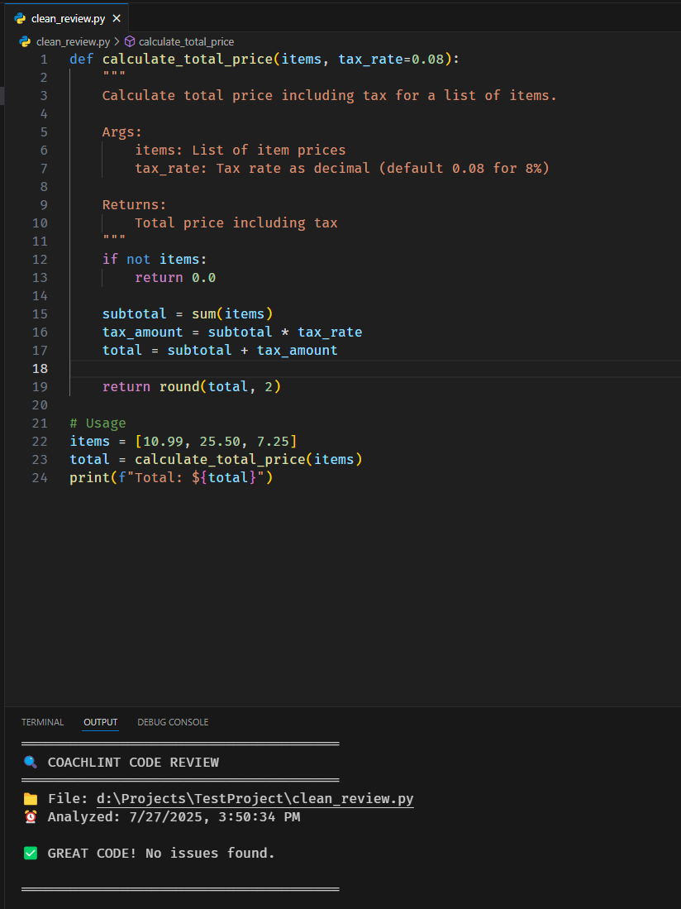

# CoachLint - Your AI Programming Coach

[](https://marketplace.visualstudio.com/items?itemName=PranayGhuge.coachlint)
[](https://marketplace.visualstudio.com/items?itemName=PranayGhuge.coachlint)
[](https://marketplace.visualstudio.com/items?itemName=PranayGhuge.coachlint)

[Boot.dev Hackathon](https://blog.boot.dev/news/hackathon-2025/)


CoachLint is your AI coding coach. It guides you through errors instead of ***just solving them for you.***

## 🚀 Installation

### From VS Code Marketplace (Recommended)
1. Open VS Code
2. Go to Extensions (`Ctrl+Shift+X`)
3. Search for "CoachLint"
4. Click "Install"

**Or install directly**: [VS Code Marketplace - CoachLint](https://marketplace.visualstudio.com/items?itemName=PranayGhuge.coachlint)

### From Command Line
```bash
code --install-extension PranayGhuge.coachlint
```

## My Motivation

Developers are becoming increasingly dependent on quick code fixes and instant code generation. When we use external AI tools, there's no middle ground - the AI just gives you the answer. People copy-paste solutions without understanding the **why** behind them.

This approach makes us lose the core skill that makes a software engineer valuable: **understanding the problem and solving it systematically**.

**AI is best for breaking down complex errors into very easy and understandable explanations.** I believe CoachLint will help developers learn more deeply instead of developing shallow programming skills.

## ✨ Features

- **Error Explanations** - Hover over errors for plain English explanations
- **Code Quality Review** - Get improvement suggestions for your Python code
- **Educational Focus** - Learn concepts, not just quick fixes
- **Secure API Key Storage** - Your API key is stored securely in VS Code settings
- **Smart Caching** - Explanations are cached to reduce API calls

## ⚙️ Setup

### API Key Configuration
1. Get your Gemini API key from [Google AI Studio](https://makersuite.google.com/app/apikey)
2. Open Command Palette (`Ctrl+Shift+P`)
3. Type `CoachLint: Set API Key`
4. Enter your API key securely

> API key is stored securely in the VS Code configurations. Remove the key once done, using *CoachLint: Clear API Key* command

## 🎯 Usage

### Hover Error Explanations
1. Write Python code with errors
2. **Hover** over red squiggly lines
3. Get instant AI explanation

### Code Quality Review
1. Open any Python file
2. Press `Ctrl+Shift+P` → "CoachLint: Review Current File"
3. Get suggestions in output panel

## 📋 Commands

- `CoachLint: Set API Key` - Configure API key
- `CoachLint: Review Current File` - Get code suggestions
- `CoachLint: Show API Key Status` - Check configuration
- `CoachLint: Clear API Key` - Remove stored API key

## 📸 Demo Screenshots

### Hovering over the error

#### Example 1


#### Example 2


### Code Review Command

#### Example 1


#### Example 2


## 🔒 Privacy & Security

- Your API key is stored locally in VS Code settings
- Code is only sent to Google Gemini for processing
- No code or personal data is stored by CoachLint
- You can clear your API key anytime

## 🤝 Contributing

Found a bug or have a feature request? 

- **Issues**: [GitHub Issues](https://github.com/Pranay0205/coachlint/issues)
- **Source Code**: [GitHub Repository](https://github.com/Pranay0205/coachlint)

## 📄 License

This project is licensed under the MIT License - see the [LICENSE](LICENSE) file for details.

## 🎉 Boot.dev Hackathon

Thank you, [Boot.dev](https://www.boot.dev), for hosting this event and your amazing content!

---

### Remember: The goal isn't to fix your code faster - it's to make you a better programmer.

⭐ **Enjoying CoachLint?** Please rate it on the [VS Code Marketplace](https://marketplace.visualstudio.com/items?itemName=PranayGhuge.coachlint)!